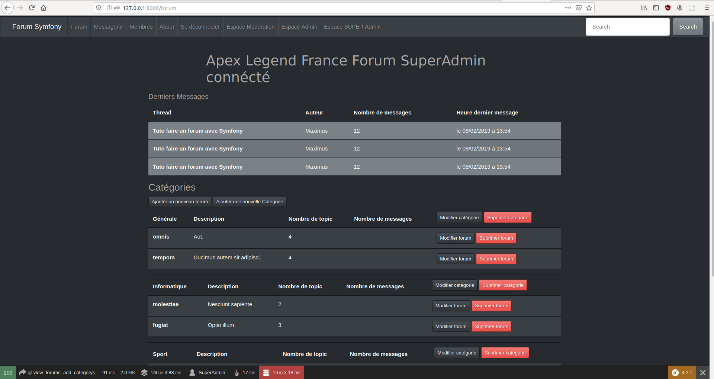

# Forum crée sous Symfony
Ce projet est un forum que j'ai codé afin d'apprendre Symfony, cet apprentissage a été réalisé car je souhaitais intégrer en stage l'entreprise Raccourci Agency en tant que développeur Back end.

Je me suis principalement focalisé sur le back et les fonctionnalités réalisable grâce à Symfony donc l'UX design laisse un peu à désirer, néanmoins j'ai beaucoup travailler sur ce projet afin de développer des fonctionnalités cohérentes à l'utilisation et à la gestion d'un forum par ses utilisateurs et administrateurs.

Le projet s'organise de catégories contenants des forums dans lesquelles les utilisateurs peuvent poster du contenu *(créer des threads (topics) et y poster des commentaires)*

***Date du projet** : du 01/2019 au 03/2019*

## Fonctionnalités développées

#### Utilisateur :
* S'inscrire sur le site de manière sécurisée
* Confirmer son inscription via un mail en cliquant sur une url générée avec un token
* Se connecter au site
* Pouvoir créer des threads
* Pouvoir poster des commentaires sur des Threads existants
* Éditer/Supprimer ses commentaires et threads postés
* S'ajouter un avatar de profil via sa page de profil
* Voir la liste des membres du forum
* Voir le nombre de commentaires et threads postés par un utilisateur
* Envoyer un message privé à un utilisateur
* Supprimer et/ou archiver les messages dans sa boîte de réception
* Pouvoir signaler un thread, commentaire ou utilisateur pour faciliter le travail des modérateurs
* Changer son mot de passe en cas d'oubli
* Se déconnecter
### Gestion du forum :
#### Modérateur *(fonctionnalitées supplémentaires accessibles)*
* Acceder aux signalements généré par les utilisateurs de manière organisé
* Pouvoir supprimer/éditer un message ou thread
* Ne pas etre en mesure d'éditer un commentaires ou thread posté par un super admin ou admin
#### Administrateur
* Ajouter/Modifier un forum au sein d'une catégorie
#### Super Administrateur
* Ajouter/Modifier/Supprimer un forum au sein d'une catégorie
* Supprimer une catégorie

## Aperçu du forum

Format: 